# Kratos Energy CRM — Master Architecture Blueprint

> **Product:** Kratos Energy CRM (Australian solar company)
> **Status:** Blueprint v2.0 — single source of truth
> **Focus:** **Lead capture → assignment → sales conversion → close**, with **source tracking** and **landing pages**.
> **Stance:** This document is the contract. Code is generated *from* it.

## Scope (v2.0)

**In scope**
- Multi-source **lead capture**: website forms, landing pages, social media, chatbot.
- **Source attribution** — track exactly where each lead came from (channel, campaign, UTM, landing page, ad).
- **Lead assignment** to sales reps (manual + auto round-robin).
- **Sales conversion**: rep works a lead → creates a **Deal (sale)** → moves through pipeline → **Won/Lost (close)**.
- **Products + Packages catalog** — products exist only to (a) **display on landing pages** and (b) **build packages from products**. Schema follows the uploaded PDF as-is.
- **Landing page builder** + dynamic lead forms.
- Activities, notes, tasks, notifications, analytics (lead-source ROI), RBAC.

**Out of scope (removed in v2.0)**
- ❌ Customer login / customer portal
- ❌ Invoices, payments, refunds, commissions
- ❌ Product storage / inventory / warehouses / suppliers / purchase orders / serials
- ❌ Projects, installations, field ops, vehicles
- ❌ Support tickets, warranty claims, equipment registration

> **Product role (confirmed):** Products are stored **only** so landing pages can show them and so packages can be composed from them. The `products`, `packages`, and `package_products` tables follow the **uploaded PDF schema verbatim** (including `stock`, `final_price` GENERATED, rebate columns). They are **not** an inventory system — `stock` is a display attribute, not a managed quantity. No warehouse/transaction/supplier tables are added.

---

## Table of Contents

1. [Executive Summary](#1-executive-summary)
2. [Business Workflow](#2-business-workflow)
3. [Analyze Existing Database](#3-analyze-existing-database)
4. [Missing Database Tables](#4-missing-database-tables)
5. [ER Diagram](#5-er-diagram)
6. [Backend Architecture](#6-backend-architecture)
7. [Frontend Architecture](#7-frontend-architecture)
8. [API Design](#8-api-design)
9. [RBAC](#9-rbac)
10. [CRM Pipeline](#10-crm-pipeline)
11. [Dashboard Design](#11-dashboard-design)
12. [Lead Source Tracking & Attribution](#12-lead-source-tracking--attribution)
13. [Landing Page Specifications](#13-landing-page-specifications)
14. [Notifications](#14-notifications)
15. [Security](#15-security)
16. [Performance](#16-performance)
17. [DevOps](#17-devops)
18. [Coding Standards](#18-coding-standards)
19. [Development Roadmap](#19-development-roadmap)

---

# 1. Executive Summary

## 1.1 Purpose

Kratos Energy CRM is a **lead-management system**. One job, done well: **pull leads in from every channel, know exactly where each came from, assign them to sales reps fast, and track each lead until a rep converts it to a sale and closes it (won or lost).**

The system also serves **marketing**: staff build **landing pages** with **dynamic lead-capture forms**, attach **packages** (bundles of solar products) to those pages, and measure which channels/campaigns/pages produce the best leads.

This v2.0 blueprint deliberately strips out invoicing, payments, inventory, installations, and customer portals to keep the product sharp and shippable.

## 1.2 Architecture at a Glance

| Layer | Choice | Why |
|---|---|---|
| Backend | Node.js + TypeScript + Express | Type safety, broad hiring pool |
| Data | PostgreSQL + Prisma ORM | Relational integrity + JSONB for dynamic forms |
| Cache / queues | Redis + BullMQ | Sessions, rate limits, async (email/SMS/social polling) |
| Realtime | Socket.io | Live "new lead assigned" alerts |
| Object storage | MinIO (S3) | Lead form uploads (power bills, roof photos), landing-page media |
| Validation | Zod (shared FE/BE) | One schema language across the stack |
| Frontend | React + Vite + TS + shadcn/ui + Tailwind | Fast DX, accessible base |
| Server state | TanStack Query | Caching, background refetch |
| UI state | Zustand | UI-only |
| Auth | JWT + rotating refresh tokens | Stateless API, revocable |

**Patterns:** Modular Feature-Based + Clean Architecture + Repository + Service Layer + DTO + Validation Layer + RBAC + REST.

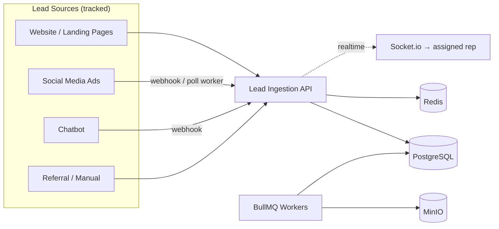

## 1.3 Scalability, Maintainability, Security (short)

- **Scalable:** stateless app tier behind a load balancer; async social-polling/notifications via BullMQ; `leads`/`lead_activities` designed for time/office partitioning at millions of rows; multi-office tenancy column baked in.
- **Maintainable:** feature modules (auth, leads, deals, marketing…), each owning controller→service→repository→DTO→validator; DTO boundary decouples DB shape from API shape.
- **Secure:** JWT + rotating refresh, 4-role RBAC with row-level (office + assignee) scoping, Zod validation everywhere, Prisma (SQLi-safe), rate-limited public intake, immutable audit log. Detail in [§15](#15-security).

---

# 2. Business Workflow

The lifecycle is short and focused: **visitor → lead → assignment → deal → close.**

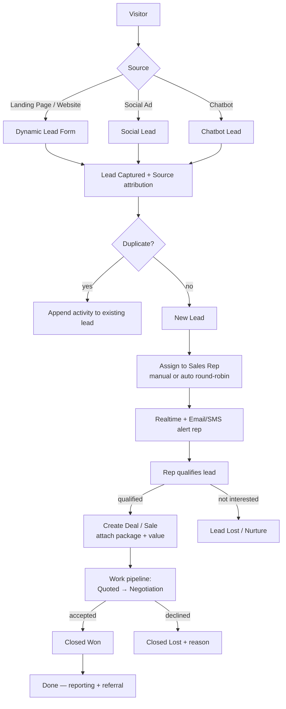

**Handoff (marketing → sales):**

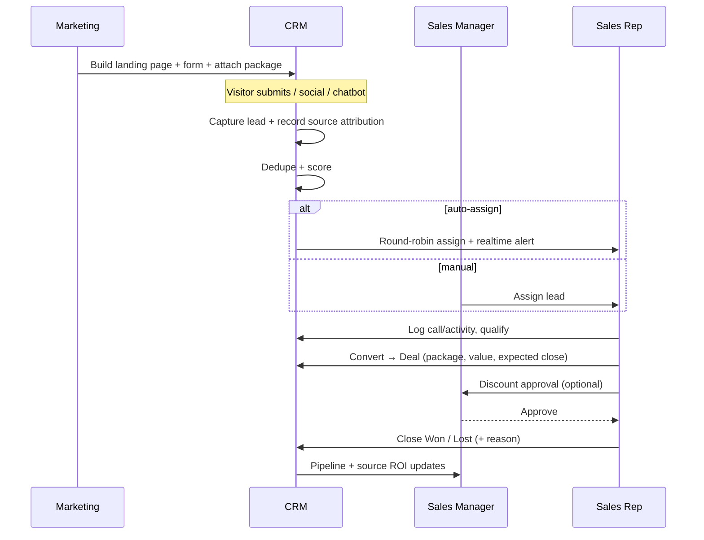

---

# 3. Analyze Existing Database

Seven tables exist. Review focuses on the in-scope ones (lead, source, marketing, catalog). **Global gaps** apply to all: missing `updated_at`/`deleted_at`/`created_by`, no `office_id` tenancy, JSONB columns un-indexed.

### 3.1 `users`
`id, name, email, password_hash, role(enum: admin|marketing_executive), created_at, updated_at`

| Aspect | Finding |
|---|---|
| **Why** | Staff auth/authz. |
| **Missing** | `office_id, phone, avatar_url, is_active, last_login_at, email_verified_at, failed_login_count, locked_until, deleted_at`. |
| **Normalization** | **Enum has only 2 roles** — need Admin/Manager/Marketing/Sales. Move to `roles` + `permissions` + `role_permissions`. Split `name`→`first_name`/`last_name`. |
| **Indexes** | `email` unique (good); add `office_id`, `is_active`, partial `WHERE deleted_at IS NULL`. |
| **Relationships** | FK target for `leads.assigned_to`, `deals.owner_id`, `audit_logs.user_id`. |

### 3.2 `products`
`id, category, brand_name, capacity, stock, base_price, state_rebate, federal_rebate, final_price(GENERATED), image_url, official_url, created_at`

| Aspect | Finding |
|---|---|
| **Why** | Component catalog. **Purpose: display on landing pages + compose packages.** Schema kept **as per PDF** (`stock`, `final_price` GENERATED, `state_rebate`, `federal_rebate` all retained). |
| **Keep as-is** | `stock` stays (display attribute, PDF schema) — **not** managed inventory, no transaction ledger. `final_price` GENERATED column kept for display. |
| **Optional additions** | `is_active` (hide from landing pages without deleting), `description`, `updated_at`. Add only if needed — not required by scope. |
| **Normalization (optional, not forced)** | `category`/`capacity` are free-text in the PDF; fine for display. Only normalize if landing-page filtering by category/wattage is wanted later. |
| **GENERATED `final_price`** | Used for display on landing pages. When recording what a deal sold, **snapshot** the price onto the deal item — rebates change over time. |
| **Indexes** | `category` (display grouping), `is_active` if added. |

### 3.3 `packages`
`id, name, description, power, estimated_price, created_at`

| Aspect | Finding |
|---|---|
| **Why** | **Package design model — bundles built from products, shown on landing pages.** Schema kept **as per PDF** (`name, description, power, estimated_price`). |
| **Optional additions** | `slug` (clean landing-page URL), `is_published` (control landing-page visibility), `image_url`. Add only if needed. |
| **Pricing note** | PDF stores `estimated_price` manually. Optionally compute it from `package_products` (sum of product `final_price` × `quantity`) so it can't drift — keep `estimated_price` as an override field. Not forced. |
| **Indexes** | `slug` unique (if added), `is_published` (if added). |

### 3.4 `package_products` (junction)
`package_id, product_id, quantity, PK(package_id, product_id)`

| Aspect | Finding |
|---|---|
| **Why** | **The mechanism for "create package from products."** Correct M:N package↔product. Schema kept **as per PDF** (`package_id, product_id, quantity`, composite PK, CASCADE/RESTRICT). |
| **Optional additions** | `sort_order` (display order of components on the landing page), `is_optional` (mark upsell add-on). Add only if needed. |
| **Constraints** | PDF already has `CHECK(quantity DEFAULT 1)`; consider `CHECK(quantity>0)`. Add secondary index on `product_id` for "which packages use this product?". |

### 3.5 `landing_pages`
`id, title, hero_description, url_slug(unique), detailed_description, created_at`

| Aspect | Finding |
|---|---|
| **Why** | Marketing lead-gen pages. **Central to scope** — see [§13](#13-landing-page-specifications). |
| **Missing** | `office_id, status(draft/published/archived), published_at, seo_meta(jsonb), hero_image_url, thank_you_message, redirect_url, view_count, conversion_count, campaign_id(fk), package_id(fk, featured package), theme_config(jsonb), created_by, updated_at, deleted_at`. |
| **Indexes** | `url_slug` unique (good), `status`, `campaign_id`. |
| **Relationships** | 1—N `custom_lead_forms`, 1—N `leads`, N—1 `marketing_campaigns`, N—1 `packages` (featured). |

### 3.6 `custom_lead_forms`
`id, landing_page_id(fk), form_title, fields_schema(jsonb), created_at`

| Aspect | Finding |
|---|---|
| **Why** | Dynamic form builder — strong design, retained. |
| **Missing** | **`version`** (forms evolve; submissions must validate vs the version captured), `is_active, submit_button_text, success_action, updated_at`. |
| **Indexes** | `landing_page_id`; GIN on `fields_schema` if queried. |

### 3.7 `leads` — the heart of the system
`id, landing_page_id(fk,SET NULL), name, email, phone_number, address, lead_type, custom_form_responses(jsonb), created_at`

| Aspect | Finding |
|---|---|
| **Why** | Central capture of every prospect. **Most important + most under-built table.** |
| **Critical missing** | `office_id`, **`lead_source_id`** (channel FK), **`utm_source/medium/campaign/term/content`**, `campaign_id`, **`stage_id`** (pipeline), **`status`**, **`assigned_to`** (FK users), `score`, `priority`, `first_name`/`last_name` (split `name`), `secondary_phone`, **AU address split**: `suburb/state/postcode` (out of free-text `address`), `property_type`, `roof_type`, `estimated_system_size`, **`consent_marketing`** (AU Privacy/Spam Act), `ip_address`, `user_agent`, `referrer_url`, `converted_at`, `lost_reason`, `next_follow_up_at`, `updated_at`, `deleted_at`. |
| **Normalization** | `name`→first/last; `address` TEXT → structured AU fields (territory routing + dedupe); `lead_type` free-text → FK `lead_sources`. **No status/stage/assignee anywhere** — add `stage_id`, `assigned_to`, and `lead_status_history`. |
| **Indexes** | `email`, `phone_number` (dedupe), `assigned_to`, `stage_id`, `lead_source_id`, `created_at`, `office_id`, composite `(assigned_to, stage_id)`, GIN on `custom_form_responses`, partial soft-delete. |
| **Constraints** | `email` **not** globally unique (dedupe in service). `CHECK(score BETWEEN 0 AND 100)`. |
| **Relationships** | N—1 `landing_pages`, `lead_sources`, `users`(assignee); 1—N `lead_activities`, `lead_notes`, `lead_status_history`, `tasks`; 1—1/1—N `deals`. |

---

# 4. Missing Database Tables

Lean set — only what the lead → assign → convert → close + source-tracking + landing-page scope needs. (Audit cols `created_at/updated_at/deleted_at/created_by/office_id` implied on mutable tables.)

## 4.1 Identity & RBAC

| Table | Purpose | Key Relationships | Important Columns | Indexes |
|---|---|---|---|---|
| **offices** | Multi-office tenancy. | 1—N users, leads | `name, code, timezone, is_active` | `code` unique |
| **roles** | RBAC roles (replaces user enum). | M—N permissions | `name, slug, description` | `slug` unique |
| **permissions** | Granular perms (`leads.read`). | M—N roles | `resource, action, slug` | `slug` unique |
| **role_permissions** | Join. | — | `role_id, permission_id` | PK |
| **user_sessions** | Active sessions (revoke/audit). | N—1 users | `user_id, ip, user_agent, last_seen_at, revoked_at` | `user_id` |
| **refresh_tokens** | Rotating refresh store (hashed). | N—1 users | `user_id, token_hash, expires_at, revoked_at, replaced_by` | `token_hash` unique |

## 4.2 Lead Source & Marketing (attribution core)

| Table | Purpose | Key Relationships | Important Columns | Indexes |
|---|---|---|---|---|
| **lead_sources** | Channel catalog (Website, Facebook, Instagram, TikTok, Google, Chatbot, Referral, Manual). | 1—N leads | `name, type, is_active` | `name` unique |
| **marketing_campaigns** | Campaign + spend for ROI. | 1—N leads, landing_pages | `name, channel, budget, spend, start_date, end_date, utm_campaign, is_active` | `utm_campaign` |
| **social_integrations** | OAuth config per platform for lead-ad ingestion. | N—1 office | `platform, page_id, access_token(enc), webhook_secret, status, last_synced_at` | `platform` |
| **chatbot_sessions** | Chatbot transcript that produced a lead. | 1—1 lead | `session_id, transcript(jsonb), bot_version, lead_id` | `session_id` |
| **lead_attributions** | Full first/last-touch attribution per lead. | N—1 lead | `lead_id, source_id, campaign_id, landing_page_id, utm(jsonb), referrer_url, gclid/fbclid, touch_type` | `lead_id`, `(source_id, created_at)` |

## 4.3 Lead Workflow

| Table | Purpose | Key Relationships | Important Columns | Indexes |
|---|---|---|---|---|
| **pipeline_stages** | Configurable pipeline stages. | 1—N leads/deals | `name, slug, order, type(lead/deal), is_won, is_lost` | `slug` unique |
| **lead_status_history** | Immutable stage-change trail. | N—1 lead | `lead_id, from_stage, to_stage, changed_by, reason, changed_at` | `(lead_id, changed_at)` |
| **lead_notes** | Notes on a lead. | N—1 lead | `lead_id, body, is_pinned, created_by` | `lead_id` |
| **lead_activities** | Timeline (calls/emails/meetings/system). | N—1 lead | `lead_id, type, channel, subject, body, occurred_at, user_id` | `(lead_id, occurred_at)` |
| **lead_assignments** | Assignment history (who/when/why). | N—1 lead/user | `lead_id, assigned_to, assigned_by, method(manual/auto), assigned_at` | `(lead_id, assigned_at)` |
| **lead_scoring_rules** | Configurable scoring weights. | — | `name, condition(jsonb), points, is_active` | — |
| **tasks** | Follow-ups for reps. | N—1 user/lead | `title, due_at, status, priority, assignee_id, lead_id` | `(assignee_id, due_at)` |
| **appointments** | Site visits / sales meetings. | N—1 lead/user | `type, starts_at, ends_at, location, status, assignee_id, lead_id` | `(assignee_id, starts_at)` |

## 4.4 Sales (Deals — the "convert & close")

| Table | Purpose | Key Relationships | Important Columns | Indexes |
|---|---|---|---|---|
| **deals** | A sale created from a qualified lead. | N—1 lead, owner(user); 1—N deal_items | `deal_number, lead_id, owner_id, stage_id, status(open/won/lost), value, expected_close_date, closed_at, lost_reason, package_id` | `deal_number` unique, `status`, `(owner_id, stage_id)` |
| **deal_items** | What the deal sold (package/product) w/ snapshot price. | N—1 deal | `deal_id, item_type, product_id, package_id, qty, unit_price_snapshot, line_total` | `deal_id` |
| **deal_stage_history** | Immutable deal stage trail. | N—1 deal | `deal_id, from_stage, to_stage, changed_by, changed_at` | `(deal_id, changed_at)` |
| **discount_approvals** | Manager approval trail (optional). | N—1 deal | `deal_id, requested_by, approved_by, amount, status, reason` | `deal_id` |

## 4.5 Catalog (PDF schema — display + package building only)

**No new tables required.** Use `products`, `packages`, `package_products` exactly as defined in the uploaded PDF. They serve two jobs only: render on landing pages and compose packages from products. No inventory/warehouse/supplier/transaction tables. Optional non-breaking columns (`is_active`, `slug`, `is_published`) listed in [§3](#3-analyze-existing-database) — add only if landing-page UX needs them.

## 4.6 Content / Marketing pages

| Table | Purpose | Key Relationships | Important Columns | Indexes |
|---|---|---|---|---|
| *(landing_pages / custom_lead_forms — existing, extended per [§3](#3-analyze-existing-database) & [§13](#13-landing-page-specifications))* | | | | |
| **form_submissions** | Raw submission record (audit, even pre-dedupe). | N—1 form/landing_page → lead | `form_id, landing_page_id, lead_id, raw_payload(jsonb), ip, user_agent, status` | `(landing_page_id, created_at)` |
| **media_library** | Reusable landing-page assets. | N—1 office | `name, file_id, folder, tags` | `folder` |

## 4.7 Platform: Files, Notifications, Audit, Settings, Analytics

| Table | Purpose | Key Relationships | Important Columns | Indexes |
|---|---|---|---|---|
| **files** | Object-storage metadata (MinIO). | — | `bucket, key, mime, size, checksum, uploaded_by` | `key` unique |
| **attachments** | Files attached to lead/deal/page. | polymorphic | `attachable_type, attachable_id, file_id, label` | composite |
| **notifications** | In-app/queued alerts. | N—1 user | `user_id, type, title, body, channel, read_at, data(jsonb)` | `(user_id, read_at)` |
| **email_templates** | Reusable emails. | — | `name, subject, body, variables, is_active` | `name` |
| **sms_templates** | Reusable SMS. | — | `name, body, variables, is_active` | `name` |
| **audit_logs** | Immutable mutation trail. | N—1 user | `user_id, action, entity_type, entity_id, before(jsonb), after(jsonb), ip` | `(entity_type, entity_id)`, `created_at` |
| **system_settings** | Key/value config (global + office). | N—1 office | `key, value(jsonb), scope, office_id` | `(scope, key, office_id)` unique |
| **analytics_events** | Raw events (page view, form view, submit, conversion). | — | `event, source, landing_page_id, session_id, properties(jsonb), occurred_at` | `(event, occurred_at)` |
| **saved_filters** | Saved table views per user. | N—1 user | `user_id, entity, name, criteria(jsonb), is_shared` | `(user_id, entity)` |

---

# 5. ER Diagram

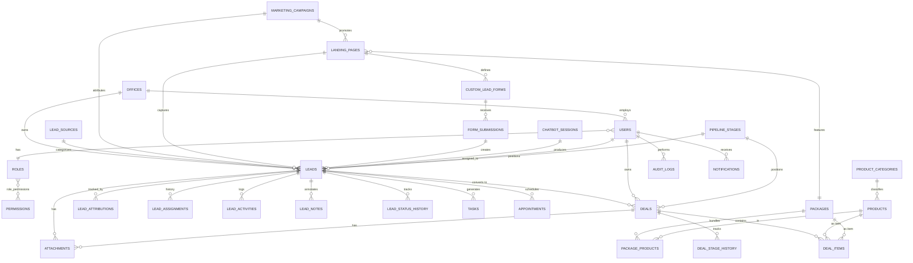

---

# 6. Backend Architecture

Modular Feature-Based + Clean Architecture. Lean module set matching scope.

```
kratos-backend/
├── src/
│   ├── modules/
│   │   ├── auth/               # login, refresh, logout, password reset
│   │   ├── users/             # staff CRUD, profile
│   │   ├── roles/             # roles, permissions (RBAC admin)
│   │   ├── offices/           # multi-office
│   │   ├── leads/             # capture, dedupe, score, assign ← CORE
│   │   ├── pipeline/          # stages, status history, kanban
│   │   ├── activities/        # notes, activities, tasks, appointments
│   │   ├── deals/             # convert lead → deal, items, close won/lost ← CORE
│   │   ├── sources/           # lead_sources, attribution, analytics feed
│   │   ├── intake/            # social + chatbot webhook adapters
│   │   ├── marketing/         # landing pages, dynamic forms, campaigns, media
│   │   ├── catalog/           # products, categories, packages (no inventory)
│   │   ├── notifications/     # email/SMS/in-app dispatch
│   │   ├── files/             # MinIO upload, attachments
│   │   └── analytics/         # source ROI, funnel, dashboards
│   ├── shared/                # dtos, types, errors, constants, utils
│   ├── core/
│   │   ├── config/            # Zod-validated env
│   │   ├── middlewares/       # auth, rbac, error, rate-limit, request-id
│   │   ├── database/          # Prisma client, BaseRepository, transactions
│   │   ├── queue/             # BullMQ queues + worker bootstrap
│   │   ├── cache/             # Redis
│   │   ├── realtime/          # Socket.io gateway (per-office/per-rep rooms)
│   │   ├── storage/           # MinIO/S3 client (presigned URLs)
│   │   └── logger/            # pino
│   ├── jobs/                  # processors: email, sms, social-poll, analytics
│   └── index.ts
├── prisma/ (schema, migrations, seed)
├── tests/  ·  docker/  ·  docker-compose.yml  ·  .env.example
```

**Per-module layout:** `*.routes.ts → *.controller.ts → *.service.ts → *.repository.ts` + `*.schema.ts` (Zod) + `*.dto.ts` + `*.mapper.ts`.

**Dependency rule:** controller (HTTP) → service (business rules) → repository (Prisma). Services never import Express/Prisma types directly. Cross-module calls go service→service, never reach into another module's repository.

---

# 7. Frontend Architecture

```
kratos-frontend/src/
├── app/         router.tsx, providers.tsx, layouts/ (Auth, App)
├── features/
│   ├── auth/
│   ├── dashboard/
│   ├── leads/          # list, kanban board, detail, assign ← CORE
│   ├── deals/          # deal board, detail, close won/lost ← CORE
│   ├── sources/        # attribution reports
│   ├── marketing/      # landing-page builder, form builder, campaigns
│   ├── catalog/        # products + package builder
│   ├── analytics/
│   └── settings/       # users, roles, offices, templates
├── components/  ui/ (shadcn), data-table/, charts/, forms/, feedback/
├── hooks/       useAuth, usePermissions, useSocket, useDebounce
├── lib/         api/, query/ (TanStack keys), validation/ (Zod), utils/
├── stores/      Zustand (UI only: sidebar, theme, modals)
└── styles/      Tailwind tokens, dark mode
```

| Concern | Decision |
|---|---|
| **Areas** | Auth · Admin (users/roles/offices/settings) · Marketing (landing pages, forms, campaigns) · Sales (leads, deals, pipeline, calendar) · Analytics. |
| **Layouts** | `AuthLayout`, `AppLayout` (sidebar + topbar + breadcrumbs). No customer portal. |
| **Protected routes** | `<RequireAuth>` + `<RequirePermission perm="leads.read">`. |
| **State** | Server → TanStack Query. UI-only → Zustand. No business data in Zustand. |
| **API layer** | Typed per-feature modules; client injects token, handles 401→silent refresh, normalizes envelope. |
| **Reusable** | `DataTable` (TanStack Table: server sort/filter/paginate), `KpiCard`, `ChartCard` (Recharts), `FormField` (RHF+Zod), `ConfirmDialog`, `EmptyState`. |
| **Forms** | React Hook Form + zodResolver; schemas shared with backend. |
| **Realtime** | `useSocket` → live "lead assigned to you" toast + list refresh. |
| **Theme** | Tailwind + CSS vars, dark mode toggle. |
| **Error/Loading** | App + per-route error boundaries; route-level lazy + skeletons; optimistic kanban drag (Framer Motion). |

---

# 8. API Design

Base `/api/v1`. Envelope: `{ success, data, meta }` / `{ success, error:{code,message,details} }`. Bearer auth. Lists: `?page|cursor&limit&sort&order&search&filter[...]`.

| Domain | Method & Path | Purpose |
|---|---|---|
| **Auth** | `POST /auth/login`·`/refresh`·`/logout`·`/forgot-password`·`/reset-password`·`GET /auth/me` | Sessions |
| **Users** | `GET/POST /users`, `GET/PATCH/DELETE /users/:id` | Staff (admin) |
| **RBAC** | `GET/POST /roles`, `PATCH /roles/:id/permissions`, `GET /permissions` | Roles |
| **Offices** | `GET/POST/PATCH /offices` | Multi-office |
| **Leads (core)** | `POST /leads/submit` | **Public** dynamic intake (validates vs `fields_schema`, records source) |
| | `GET /leads` | List: filter by source, stage, assignee, campaign, date |
| | `GET /leads/:id` | Detail + activities + attribution |
| | `PATCH /leads/:id` | Update |
| | `PATCH /leads/:id/stage` | Move stage (writes status history) |
| | `PATCH /leads/:id/assign` | Assign/reassign rep |
| | `POST /leads/:id/notes`·`/activities`·`/tasks` | Annotate / log / follow-up |
| | `POST /leads/:id/convert` | **Convert → Deal** |
| | `GET /leads/export` | CSV/XLSX export |
| **Intake** | `POST /intake/social/:platform`, `POST /intake/chatbot` | Source webhooks |
| **Pipeline** | `GET /pipeline/stages`, `GET /pipeline/board` | Kanban |
| **Deals (core)** | `GET/POST /deals`, `GET/PATCH /deals/:id`, `POST /deals/:id/items` | Sale record |
| | `PATCH /deals/:id/stage`, `POST /deals/:id/win`, `POST /deals/:id/lose` | **Close won/lost** |
| **Sources** | `GET /sources`, `GET /sources/attribution`, `GET /campaigns` | Attribution |
| **Catalog** | `GET/POST /products`, `GET /product-categories`, `GET/POST /packages`, `POST /packages/:id/products`, `GET /packages/:id/pricing` | Products + packages |
| **Marketing** | `GET/POST /landing-pages`, `GET /p/:slug` (public), `GET/POST /landing-pages/:id/forms`, `GET/POST /campaigns`, `POST /media` | Pages/forms |
| **Notifications** | `GET /notifications`, `PATCH /notifications/:id/read`, WS stream | Alerts |
| **Files** | `POST /files/presign`, `POST /files`, `POST /attachments` | Uploads |
| **Analytics** | `GET /analytics/overview`·`/leads-by-source`·`/funnel`·`/sales`, `POST /analytics/events` | Reporting |
| **Settings** | `GET/PATCH /settings`, `GET/POST /templates` | Config |

---

# 9. RBAC

4 roles (down from 8). Roles ↔ permissions via `role_permissions`; slug = `resource.action`.

| Role | Scope | Key Permissions | Allowed Pages |
|---|---|---|---|
| **Admin** | Full system | `*.*`, RBAC, settings, offices | Everything |
| **Manager** (Sales Manager) | Oversee leads + deals, assign, approve | `leads.* (all office)`, `deals.* (+approve)`, `users.read`, `analytics.read`, `assignments.*` | Dashboards, leads, deals, pipeline, reports |
| **Marketing** | Lead gen + attribution | `landing_pages.*`, `forms.*`, `campaigns.*`, `lead_sources.*`, `catalog.read`, `leads.read`, `leads.export`, `analytics.read` | Marketing area, catalog (read), lead list (read/export), analytics |
| **Sales** (Rep) | Own leads + deals | `leads.read/write (assigned)`, `deals.create/read/update/close (own)`, `tasks.*`, `appointments.*`, `activities.*`, `catalog.read` | Leads, deals, pipeline, calendar |

**Enforcement:** backend `requirePermission()` middleware + **row-level scoping** (`office_id` + `assigned_to`/`owner_id`) in service layer. Frontend `usePermissions()` gates UI but is never the security boundary — server always re-checks.

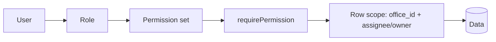

---

# 10. CRM Pipeline

Two linked tracks: **Lead pipeline** (pre-conversion) → **Deal pipeline** (post-conversion, ends in close). Stages configurable in `pipeline_stages`.

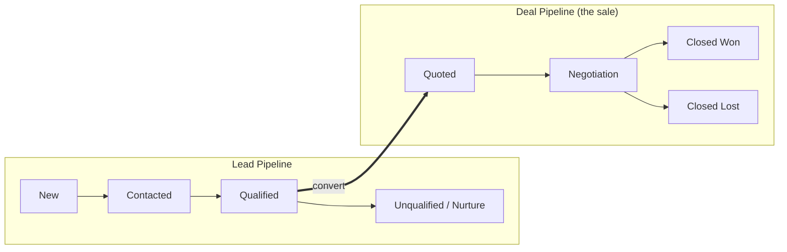

| Stage | Track | Entry criteria | Exit action |
|---|---|---|---|
| **New** | Lead | Captured from any source, assigned | First contact attempt |
| **Contacted** | Lead | Rep reached out | Qualify |
| **Qualified** | Lead | Intent + budget confirmed | **Convert → Deal** |
| **Unqualified** | Lead | Not a fit / no response | Nurture or close |
| **Quoted** | Deal | Package + value attached, proposal sent | Negotiate |
| **Negotiation** | Deal | Customer reviewing, discount approvals | Accept/decline |
| **Closed Won** | Deal | Agreement reached | Record value, referral ask |
| **Closed Lost** | Deal | Declined | Capture `lost_reason` |

**Mechanics:** drag-drop kanban (optimistic), auto-task on stage entry ("call within 24h"), rotting-lead detection (no activity N days → flag), SLA timers + manager escalation.

---

# 11. Dashboard Design

| Dashboard | KPI Cards | Tables | Charts |
|---|---|---|---|
| **Admin** | Total leads, active users, conversion rate, deals won MTD | Recent audit logs, user activity | Leads by source, office comparison, conversion trend |
| **Sales (Rep)** | My open leads, my deals, conversion %, won value MTD | My pipeline, overdue tasks, hot leads | My funnel, win/loss, activity volume |
| **Manager** | Team leads, unassigned count, team conversion, pipeline value | Rep leaderboard, aging leads, deals to approve | Funnel by stage, rep performance, forecast |
| **Marketing** | Leads captured, cost-per-lead, top source, conversion % | Landing-page performance, campaign ROI | **Leads by channel** (website/social/chatbot), funnel, spend-vs-leads |

KPI cards show value + delta vs prior period; all respect office scope + date range. Charts via Recharts. Layout from `dashboard_widgets`/`saved_filters`.

---

# 12. Lead Source Tracking & Attribution

**Core requirement: know exactly where every lead came from.** Captured at intake, stored on the lead + in `lead_attributions`, surfaced in marketing analytics.

## 12.1 What gets captured

| Signal | Source | Stored |
|---|---|---|
| **Channel** | Which `lead_sources` row (Website, Facebook, Instagram, TikTok, Google, Chatbot, Referral, Manual) | `leads.lead_source_id` |
| **Campaign** | `marketing_campaigns` | `leads.campaign_id` |
| **UTM params** | `utm_source/medium/campaign/term/content` from URL | `leads.utm_*` + `lead_attributions.utm` |
| **Landing page** | Which page captured it | `leads.landing_page_id` |
| **Ad click IDs** | `gclid` (Google), `fbclid` (Meta) | `lead_attributions` |
| **Referrer** | `document.referrer` | `leads.referrer_url` |
| **Technical** | IP, user-agent, session id | `leads.ip_address/user_agent` |
| **Touch type** | first-touch vs last-touch | `lead_attributions.touch_type` |

## 12.2 Capture flow per channel

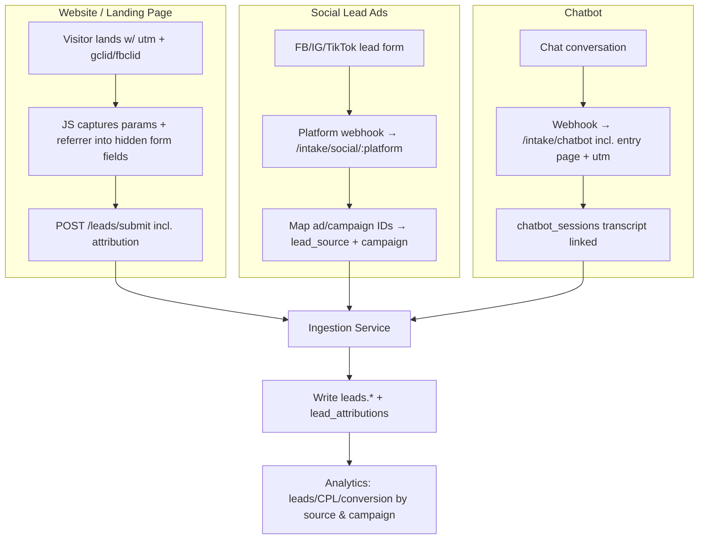

## 12.3 Attribution reporting (marketing dashboard)

- **Leads by source / campaign / landing page** — volume + conversion %.
- **Cost-per-lead** = campaign spend ÷ leads (from `marketing_campaigns.spend`).
- **Source → Won funnel** — which channels actually close, not just generate volume.
- **First-touch vs last-touch** comparison via `lead_attributions.touch_type`.
- **UTM drill-down** — group by any `utm_*`.

> **Integrity rule:** attribution is written **once at capture** and never overwritten. Re-submissions append a new `lead_attributions` row (last-touch) while preserving the original (first-touch).

---

# 13. Landing Page Specifications

Landing pages are the primary **first-party** lead source. Marketing builds them; visitors convert on them; every conversion is attributed.

## 13.1 Anatomy of a landing page

| Block | Purpose | Backed by |
|---|---|---|
| **Hero** | Headline, sub-text, hero image/video, primary CTA | `landing_pages.title/hero_description/hero_image_url` |
| **Body** | Rich content (benefits, how-it-works, social proof) | `landing_pages.detailed_description` (HTML/JSON) |
| **Featured package** | Showcase a solar package + price | `landing_pages.package_id` → `packages` |
| **Lead form** | Dynamic, configurable fields | `custom_lead_forms.fields_schema` |
| **Thank-you / redirect** | Post-submit message or URL | `landing_pages.thank_you_message/redirect_url` |
| **SEO meta** | Title, description, OG tags | `landing_pages.seo_meta` (jsonb) |
| **Theme** | Colors, fonts, layout | `landing_pages.theme_config` (jsonb) |

## 13.2 Dynamic form engine (retained + hardened)

`custom_lead_forms.fields_schema` (JSONB) drives both render and validation. Example field descriptor:

| Property | Meaning |
|---|---|
| `field_name` | Stored key in `leads.custom_form_responses` |
| `label` | Display label |
| `type` | `text · email · phone · number · select · multiselect · radio · checkbox · textarea · file · date` |
| `required` | Boolean — enforced server-side |
| `options` | For select/radio (list) |
| `validation` | min/max/regex/pattern |
| `order` | Render order |
| `placeholder` / `help_text` | UX hints |

**Server-side validation flow (existing engine, formalized):**

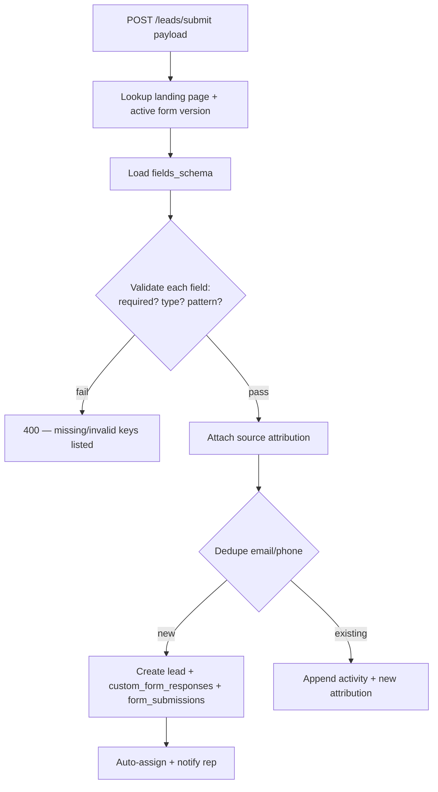

**Form versioning:** `custom_lead_forms.version` ensures a historic lead validates against the schema that existed when submitted, even after the form is edited. Raw payload always archived in `form_submissions.raw_payload`.

## 13.3 Page lifecycle & performance tracking

| State | Meaning |
|---|---|
| `draft` | Editing, not public |
| `published` | Live at `/p/:url_slug` |
| `archived` | Retired, URL retained for SEO redirect |

- **Public delivery:** `GET /p/:slug` — cached, read-only, no auth; increments `view_count` async.
- **Per-page metrics:** `view_count`, `conversion_count`, conversion rate, leads-by-page report.
- **Multi-page / multi-campaign:** a page links to a `marketing_campaign`; multiple pages per campaign supported for A/B and channel-specific landing.
- **AU compliance:** marketing consent checkbox (`consent_marketing`) captured per submission (Privacy Act / Spam Act).

## 13.4 Form uploads

File fields (e.g. power bill, roof photo) upload via **presigned MinIO URL**, then attach to the lead (`attachments` → `files`). Size/MIME validated; stored under `offices/{officeId}/leads/{leadId}/uploads/`.

---

# 14. Notifications

Channels: Email, SMS (AU sender), In-app (Socket.io + `notifications`). Queue via BullMQ with backoff + dead-letter.

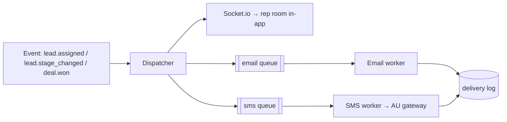

**Triggers:** new lead assigned (instant rep alert), lead unworked > SLA (manager escalation), lead stage change, deal won/lost, task due/overdue. Templates in `email_templates`/`sms_templates`; per-user channel prefs; AU Spam Act respected for any marketing message.

---

# 15. Security

| Control | Implementation |
|---|---|
| **JWT (access)** | ~15 min, signed, carries `userId, officeId, role`. |
| **Refresh tokens** | Rotating, hashed in `refresh_tokens`; reuse detection revokes family; HttpOnly secure cookie or secure storage. |
| **RBAC** | Permission middleware + row-level office/assignee scoping ([§9](#9-rbac)). |
| **Rate limiting** | Redis per-IP/user; **strict on public `/leads/submit` + `/intake/*`** (bot/spam abuse surface). |
| **Helmet / CORS** | Security headers; origin allowlist (admin app only). |
| **Validation** | Zod on every input; dynamic forms validated vs `fields_schema`. |
| **SQL injection** | Prisma parameterized only. |
| **XSS** | Sanitize landing-page rich text with allowlist; output encoding; CSP. |
| **CSRF** | SameSite=strict + token for cookie flows; Bearer API is CSRF-immune. |
| **Spam/bot intake** | Honeypot field + rate limit + optional CAPTCHA on public forms; dedupe service. |
| **Audit logs** | Immutable `audit_logs` on assignment, stage change, deal close, user/role edits. |
| **PII / AU compliance** | Consent capture, retention policy, soft-delete + hard-delete on request. |
| **Passwords** | Argon2id/bcrypt; lockout after N failures. |

---

# 16. Performance

| Lever | Strategy |
|---|---|
| **Caching (Redis)** | Catalog (products/packages), pipeline stages, settings, permission sets, published landing pages, dashboard aggregates. TTL + invalidate on write. |
| **Pagination** | Offset for admin tables (`meta.total`); **cursor** for high-volume feeds (`leads`, `lead_activities`, `analytics_events`). |
| **Filtering/sorting** | Whitelisted fields → indexed columns; reject arbitrary fields. |
| **Indexes** | FKs, `stage_id`, `assigned_to`, `lead_source_id`, `created_at`, composite `(assigned_to, stage_id)`, GIN on JSONB, partial soft-delete. |
| **DB** | Connection pooling (PgBouncer), read replica for analytics, **time/office partitioning** of `leads`, `lead_activities`, `analytics_events`, `audit_logs`. Avoid N+1 via Prisma `select/include`. |
| **Async** | Social polling, email/SMS, analytics rollups, image resize → BullMQ. |
| **Aggregations** | Pre-computed source/funnel summaries via scheduled jobs into summary tables. |
| **Frontend** | TanStack Query cache, route code-splitting, virtualized lead tables, debounced search. |

---

# 17. DevOps

| Area | Approach |
|---|---|
| **Docker** | Multi-stage Dockerfiles (api, worker, web). Compose local: postgres, redis, minio, api, worker, web. Separate worker container for BullMQ. |
| **Env vars** | Zod-validated loader; `.env.example` committed; secrets via manager; fail-fast on bad config. |
| **Logging** | Structured JSON (pino) + request/correlation id. |
| **Monitoring** | Health/readiness endpoints, metrics, Sentry, BullMQ board, slow-query log. |
| **CI/CD** | PR: lint + typecheck + test + build. Merge: build/push images, `prisma migrate deploy`, deploy. |
| **Backups** | Daily Postgres + PITR (WAL); MinIO versioning; tested restore runbook. |
| **Migrations** | Prisma Migrate, forward-only in prod; expand→backfill→contract for zero-downtime; seed roles/permissions/stages/sources. |

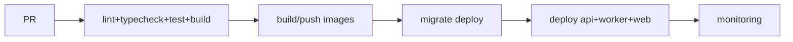

---

# 18. Coding Standards

| Topic | Standard |
|---|---|
| **DB naming** | `snake_case` plural tables; `id` UUID PK; FK `{entity}_id`; `*_at` timestamps; `is_*` booleans. |
| **Code naming** | `camelCase` vars/fns, `PascalCase` types, `SCREAMING_SNAKE` consts; files `feature.layer.ts`. |
| **Folders** | Feature modules; per-module routes/controller/service/repository/dto/schema/mapper. |
| **API format** | Uniform envelope; consistent HTTP codes. |
| **Errors** | `AppError` hierarchy (`NotFound/Validation/Forbidden/Conflict`); thrown in services, mapped by one global middleware. |
| **Validation** | Zod at controller edge; DTO types inferred from Zod. |
| **Repository** | All DB access via repositories; services never touch Prisma directly; `BaseRepository` for pagination/soft-delete/tx. |
| **Service** | Business rules + orchestration + transaction boundaries. |
| **DTO** | Separate request/entity/response; mappers translate; never leak raw rows. |
| **Testing** | Unit (services), integration (repo+DB), e2e key flows: intake → assign → convert → close. |

---

# 19. Development Roadmap

Lead-core first, then deals, then marketing depth, then insight.

```mermaid
gantt
    title Kratos CRM Phases
    dateFormat X
    axisFormat %s
    section Foundation
    P1 Auth + RBAC + Offices       :0,1
    section Lead Core
    P2 Leads + Assignment          :1,2
    P3 Source Tracking + Intake    :2,3
    section Sales
    P4 Pipeline + Deals + Close     :3,4
    section Marketing
    P5 Landing Pages + Forms        :4,5
    P6 Catalog (Products+Packages)  :5,6
    section Insight
    P7 Notifications                :6,7
    P8 Analytics + ROI              :7,8
    P9 Hardening + Production       :8,9
```

| Phase | Scope | Deliverables |
|---|---|---|
| **1 — Auth** | Foundation | JWT + refresh rotation, roles/permissions (Admin/Manager/Marketing/Sales), offices, audit-log base |
| **2 — Leads** | **Core** | Lead model (rebuilt), capture, dedupe, scoring, **assignment** (manual + auto round-robin), notes/activities/tasks, lead pipeline + status history |
| **3 — Source tracking** | **Core** | `lead_sources`, `lead_attributions`, UTM/click-ID capture, social + chatbot intake webhooks, dedupe across channels |
| **4 — Deals** | **Sales** | Convert lead → deal, deal items (snapshot price), deal pipeline, **close won/lost** + reason, discount approvals |
| **5 — Landing pages** | Marketing | Landing-page builder, dynamic form engine + versioning, public `/p/:slug` delivery, page metrics |
| **6 — Catalog** | Marketing | Products (PDF schema, no inventory) for landing-page display, package builder from products (`package_products`), featured-package on pages |
| **7 — Notifications** | Comms | Email/SMS/in-app dispatch, templates, assignment + SLA alerts |
| **8 — Analytics** | Insight | Leads-by-source, CPL, source→won funnel, dashboards, exports |
| **9 — Production** | Hardening | Performance, partitioning, monitoring, backups, security review, load test |

---

## Appendix A — Top Schema Corrections (priority)

1. **Replace `users.role` enum** → roles/permissions/role_permissions (Admin/Manager/Marketing/Sales).
2. **Rebuild `leads`** → `lead_source_id, campaign_id, utm_*, stage_id, assigned_to, office_id, score, consent_marketing`, split name, normalize AU address; add `lead_status_history`, `lead_activities`, `lead_assignments`.
3. **Add source-tracking tables** → `lead_sources`, `lead_attributions`, `marketing_campaigns`, `social_integrations`, `chatbot_sessions`.
4. **Add deal tables** → `deals`, `deal_items` (snapshot price), `deal_stage_history`, `pipeline_stages`. This is the "convert + close".
5. **Keep `products`/`packages`/`package_products` per PDF schema** (incl. `stock`, `final_price` GENERATED). No inventory tables. Optional non-breaking adds only (`is_active`, `slug`, `is_published`).
6. **Extend `landing_pages`** → status, seo_meta, theme_config, package_id, metrics; **version `custom_lead_forms`**; add `form_submissions`.
7. **Add `office_id, updated_at, deleted_at, created_by`** across mutable tables.
8. **Add platform tables** → `refresh_tokens`, `user_sessions`, `audit_logs`, `notifications`, `files`/`attachments`, `system_settings`, `analytics_events`.
9. **Indexing pass** → FKs, stage/assignee/source, `created_at`, composites, GIN on JSONB, partial soft-delete.

## Appendix C — PDF §3 Implementation Rules: Coverage Map

The uploaded PDF's section 3 ("Implementation Instructions / Prompt for Claude") defines 3 backend feature rules. Mapping to this blueprint:

| PDF Rule | Requirement | Status | Implementation in this doc |
|---|---|---|---|
| **1. Authentication & Access** | JWT auth. Modifying **Products / Packages / Landing Pages = admin only**. `marketing_executive` may **read products** and **read + export the leads table**. | **Adapted** (scope expanded 2→4 roles) | JWT + rotating refresh ([§15](#15-security)). RBAC ([§9](#9-rbac)). See **resolution below** — the original 2-role rule is superseded but its *spirit* (catalog writes are privileged; marketing reads catalog + reads/exports leads) is preserved. |
| **2. Pricing Engine** | `final_price` dynamically computes `base_price − state_rebate − federal_rebate` before saving/outputting. | **Covered as-is** | `products.final_price` kept as the PDF's `GENERATED ALWAYS AS (...) STORED` column ([§3.2](#3-analyze-existing-database)). Postgres computes it on write; API outputs it directly. Deal items **snapshot** this value at sale time. |
| **3. Dynamic Lead Capture Validation Engine** | `POST /api/leads/submit` → service looks up matching `custom_lead_forms.fields_schema` → match, type-check, validate dynamic values → store into `custom_form_responses` JSONB → **reject missing required keys with HTTP 400**. | **Covered** | Validation-flow diagram ([§13.2](#132-dynamic-form-engine-retained--hardened)) + endpoint ([§8](#8-api-design)). Hardened with **form versioning** (validate against the schema version captured) and **raw payload archive** (`form_submissions`). |

### Rule 1 — Access-control resolution (PDF 2-role → blueprint 4-role)

The PDF assumed only `admin` + `marketing_executive`. This blueprint expanded to **Admin / Manager / Marketing / Sales** so marketing staff can *build* landing pages and sales staff can *work* leads. Updated mapping:

| Resource | Action | PDF (2-role) | Blueprint (4-role) |
|---|---|---|---|
| Products / Packages | modify | admin only | **Admin only** (`catalog.write` = Admin). Marketing/Sales = read. ✔ matches PDF intent |
| Landing Pages / Forms / Campaigns | modify | admin only | **Admin + Marketing** (`landing_pages.write`, `forms.write`). *Diverges from PDF* — required so Marketing can build pages. |
| Products | read | marketing_executive | **Marketing + Sales** read catalog. ✔ |
| Leads | read + export | marketing_executive | **Marketing** (read + export all), **Sales** (read/write assigned), **Manager** (all office). ✔ extends PDF intent |

> **Decision needed:** keep landing-page authoring with the **Marketing** role (blueprint default), or lock landing-page/form/campaign writes to **Admin only** to match the PDF literally? Default chosen: Marketing authors pages, Admin retains catalog (product/package) writes — this matches the stated workflow ("Marketing users create landing pages and forms").

---

## Appendix B — Removed vs v1.0

Removed entire domains: **customers/portal, invoices/payments/refunds/commissions, inventory/warehouses/suppliers/POs/serials, projects/installations/teams/vehicles, support/warranty**. Catalog kept lean (no stock). Roles cut 8 → 4.

---

*End of blueprint — architecture_design.md v2.0.*
