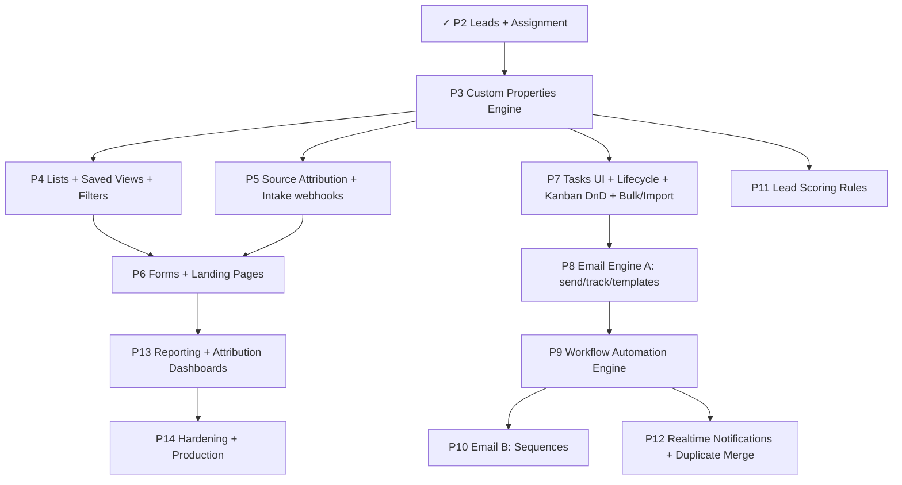

# Kratos CRM — HubSpot-Parity Expansion Plan

> **Purpose:** Extend the v2.0 lead-management build to match **HubSpot-style lead management**.
> **Status:** Draft for approval. No code written from this yet.
> **Baseline:** Phases 1–2 done (auth/RBAC/offices; leads, pipeline, round-robin assignment, activities/notes).
> **Companion to:** `architecture_design.md` (v2.0).

---

## 1. Parity target

"Same as HubSpot" for lead management means these five capabilities that we do **not** yet have, plus polish on what we do:

1. **Custom Properties** — add any field to a lead without a developer.
2. **Forms** — capture leads without manual entry (embed / popup / standalone).
3. **Source Attribution** — know exactly where each lead came from (first/last touch, UTM, ad IDs).
4. **Workflow Automation** — triggers → actions (auto-assign, auto-task, auto-email, branching).
5. **Email** — send, track (opens/clicks), templates, sequences — work leads inside the CRM.

Plus HubSpot table-stakes: **Lists/segmentation**, **saved views**, **lead scoring rules**, **tasks UI + queues**, **lifecycle stages**, **drag-drop kanban**, **bulk actions + CSV import**, **duplicate merge**, **in-app/realtime notifications**, **reporting/attribution dashboards**.

**Effort reality:** this roughly **doubles** the project vs the current v2.0 blueprint. Three subsystems (Custom Properties, Workflow Automation, Email) are net-new and each is a large build.

---

## 2. Current match (recap)

| Area | Match | Note |
|---|---|---|
| Pipeline + kanban | 🟡 70% | no drag-drop / stage editor |
| Assignment (round-robin) | 🟢 80% | add rules/weighting |
| Activity timeline | 🟡 60% | manual logging only |
| Notes, status history, RBAC | 🟢 ~80% | solid |
| Dedupe | 🟡 40% | block, not merge |
| Source/UTM, scoring, tasks | 🟠 10–20% | fields exist, no engine/UI |
| Forms, attribution, properties, automation, email, lists | 🔴 0–20% | this plan |

**Overall today: ~30% of HubSpot lead-management depth.**

---

## 3. New subsystems (design sketches)

### 3.1 Custom Properties Engine 🔴 (net-new, XL)

HubSpot's backbone: every object's fields are user-defined "properties".

**Schema**
| Table | Key columns |
|---|---|
| `property_groups` | objectType, name, label, order |
| `property_definitions` | objectType (LEAD/DEAL/CONTACT…), name, label, fieldType (text/number/select/multiselect/date/bool/phone/email/url/textarea), options(jsonb), groupId, isRequired, isDefault, isSystem, order, validation(jsonb) |
| `Lead.properties` (JSONB column) | stores custom values `{ propName: value }` |

- Values live in a **JSONB column** per object (fast, GIN-indexed) — not EAV. Definitions drive UI + validation.
- System fields (name/email/stage…) modeled as `isSystem` definitions so the UI treats built-in and custom fields uniformly.

**Backend:** `properties` module — CRUD definitions, validate a record's `properties` against definitions on write, expose schema to frontend.
**Frontend:** Property Manager (admin), **dynamic field renderer** (record edit uses definitions), dynamic **column picker** + **filter builder** driven by definitions.
**Unlocks:** custom filters, list segmentation, dynamic forms, dynamic table columns.

---

### 3.2 Lead Scoring Engine 🟠 (M)

**Schema:** `scoring_rules` (name, condition(jsonb), points, isActive), optional `score_breakdown` on lead.
- Rules evaluated on lead create + property/stage change (via event bus, §3.4). Score = Σ matched rule points, clamped 0–100.
- Manual score override retained.
**Frontend:** rule builder (condition rows → points), score badge + breakdown on lead.

---

### 3.3 Lists / Segmentation + Saved Views 🟠 (L)

**Schema**
| Table | Key columns |
|---|---|
| `lists` | name, objectType, kind(STATIC/ACTIVE), filter(jsonb), isShared, ownerId |
| `list_memberships` | listId, recordId (STATIC only) |
| `saved_views` | userId, entity, name, columns(jsonb), filter(jsonb), sort, isShared |

- **Active list** = stored filter re-evaluated on read (and membership recomputed by a job for counts).
- **Saved views** = per-user table configs (columns + filter + sort) — HubSpot's saved filters.
**Frontend:** list builder (reuses filter builder from §3.1), view switcher tabs on Leads table, list membership badges.

---

### 3.4 Workflow Automation Engine 🔴 (net-new, XL)

The biggest HubSpot differentiator.

**Schema**
| Table | Key columns |
|---|---|
| `workflows` | name, objectType, triggerType, triggerConfig(jsonb), isActive, enrollmentMode |
| `workflow_steps` | workflowId, order, actionType, config(jsonb), branchConfig(jsonb) |
| `workflow_enrollments` | workflowId, recordId, status, currentStepId, enrolledAt |
| `workflow_action_logs` | enrollmentId, stepId, status, result(jsonb), ranAt |

**Triggers:** lead created, property changed, stage changed, form submitted, list membership, inactivity/date-based, manual.
**Actions:** assign (round-robin/specific/by-territory), set property, change stage, create task, send email (§3.5), add note, add/remove from list, send internal notification, webhook, **delay**, **if/then branch**.

**Engine (core work):**
- **Event bus** (`domain events` emitted by services → BullMQ) → enrollment matcher → step executor.
- **Delays/waits** via BullMQ delayed jobs. Branching via condition eval on properties.
- Idempotent, re-entrant, with action logs for audit + a "workflow history" per record.

**Frontend:** visual workflow builder (node/step canvas) — *the* large FE piece; can start with a **linear step list** (v1) before a full canvas (v2).

---

### 3.5 Email Engine 🔴 (net-new, XL)

Work leads without leaving the CRM.

**Phase A — Outbound + tracking + templates**
| Table | Key columns |
|---|---|
| `email_templates` | name, subject, body(handlebars), variables, isActive |
| `email_messages` | leadId, toEmail, fromUserId, subject, body, status, providerId, opens, clicks, sentAt |
| `email_events` | messageId, type(DELIVERED/OPEN/CLICK/BOUNCE), meta, at |

- Send via provider (Postmark/SendGrid/SES) through BullMQ.
- **Open tracking** (pixel) + **click tracking** (link rewrite). Logs land in the lead **activity timeline** automatically → fixes the "manual-only logging" gap.
- Templates with merge fields ({{firstName}} etc.).

**Phase B — Sequences** (`sequences`, `sequence_steps`, `sequence_enrollments`): multi-step scheduled emails with auto-unenroll on reply/stage change.
**Phase C (optional) — Connected inbox:** Gmail/O365 OAuth to send-as + log replies (advanced).

**Frontend:** email composer on lead (template picker, preview), sequence enroll button, tracking status in timeline.

---

### 3.6 Enhancements to existing features

| Feature | Work | Size |
|---|---|---|
| **Source attribution** | `lead_attributions` (first/last touch, utm, gclid/fbclid, referrer); capture on form/intake | M (was Phase 3) |
| **Forms** | embeddable/standalone forms + public submit + form analytics | L (was Phase 5) |
| **Tasks UI + queues + reminders** | endpoints + task board + due/overdue + reminder jobs | M |
| **Lifecycle stages** | subscriber→lead→MQL→SQL→opportunity→customer as a property + automation | S |
| **Drag-drop kanban** | `@hello-pangea/dnd`, optimistic stage move | S |
| **Bulk actions + CSV import** | multi-select actions; import wizard w/ field mapping → properties | L |
| **Duplicate merge** | merge UI (pick surviving record, combine fields/activities) | M |
| **Realtime notifications** | Socket.io "lead assigned to you", in-app inbox | M |
| **Reporting / attribution dashboards** | funnel, source ROI, rep performance, custom report builder (light) | L |

---

## 4. Revised roadmap (expanded)

Phases 1–2 complete. Proposed re-sequencing to reach HubSpot parity, ordered by dependency + value:

| Phase | Scope | Size | HubSpot gap closed |
|---|---|---|---|
| **P3** | **Custom Properties Engine** (definitions, groups, dynamic values, validation, admin UI, dynamic fields) | XL | Custom properties |
| **P4** | **Lists + Saved Views + Filter Builder** (active/static lists, per-user views) | L | Lists/segmentation, saved views |
| **P5** | **Source Attribution + Intake** (`lead_attributions`, UTM/gclid/fbclid, social + chatbot webhooks) | M | Attribution |
| **P6** | **Forms + Landing Pages** (dynamic form builder, public submit, embed, form analytics) | L | Forms |
| **P7** | **Productivity** (Tasks UI + queues + reminders, lifecycle stages, drag-drop kanban, bulk actions, CSV import) | L | Tasks, lifecycle, bulk/import |
| **P8** | **Email A** (send + open/click tracking + templates; auto-log to timeline) | XL | Email (core) |
| **P9** | **Workflow Automation Engine** (triggers, actions, delays, branching; linear builder v1) | XL | Automation |
| **P10** | **Email B — Sequences** (multi-step, auto-unenroll) | L | Sequences |
| **P11** | **Lead Scoring Rules** (rule engine + builder UI) | M | Scoring |
| **P12** | **Realtime Notifications + Duplicate Merge** | M | Notifications, merge |
| **P13** | **Reporting + Attribution Dashboards** (funnel, source ROI, rep perf, light report builder) | L | Reporting |
| **P14** | **Hardening + Production** (perf, partitioning, monitoring, backups, security review, load test) | M | — |

**Rough sizing:** XL ≈ largest units of work, L/M/S smaller. P3, P8, P9 are the three heavyweight builds.

---

## 5. Decisions needed before starting

1. **Contacts & Companies objects?** HubSpot separates Contacts (people) + Companies (accounts) with associations. We currently have **Lead only** (companies were cut in v2.0). True B2B parity needs them. Options:
   - **(a)** Keep Lead-as-contact (simpler, current) — good for residential solar.
   - **(b)** Add Contacts + Companies + associations (more HubSpot-accurate, bigger). *Recommend (a) unless commercial/B2B solar is a priority.*
2. **Workflow builder depth:** linear step-list (v1, faster) vs full visual node canvas (v2, much bigger). *Recommend v1 first.*
3. **Email provider:** Postmark / SendGrid / AWS SES? (affects deliverability + cost). Connected Gmail/O365 inbox — in or out?
4. **Custom-property storage:** JSONB-per-object (recommended, fast) vs EAV table (flexible, slower). *Recommend JSONB.*
5. **Scope vs speed:** full parity is P3→P14 (large). Want the **full plan**, or a **"HubSpot Lite"** cut (P3 Properties + P5 Attribution + P6 Forms + P7 Productivity + P8 Email A) that hits ~70% parity for far less?

---

## 6. Risks & notes

- **Automation + Email are where HubSpot spent years.** A credible v1 is achievable; feature-complete parity is not a short effort.
- **Custom Properties must land first** — Lists, Forms, Filters, Import, and Workflows all depend on the property model. Reordered to P3 accordingly.
- **Email deliverability** needs a real domain + SPF/DKIM/DMARC on the sending domain (`kratosenergy.com.au`).
- Current v2.0 blueprint's Deals/Catalog phases (old P4/P6) still fit — folded into P7/later or kept as-is depending on decision #1.
- Nothing here changes shipped Phase 1–2 code; it extends the schema and adds modules.

---

*Draft — awaiting decisions in §5 before implementation.*
